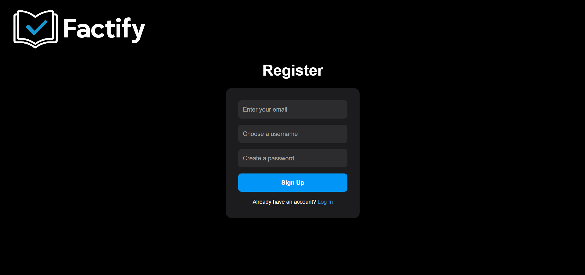
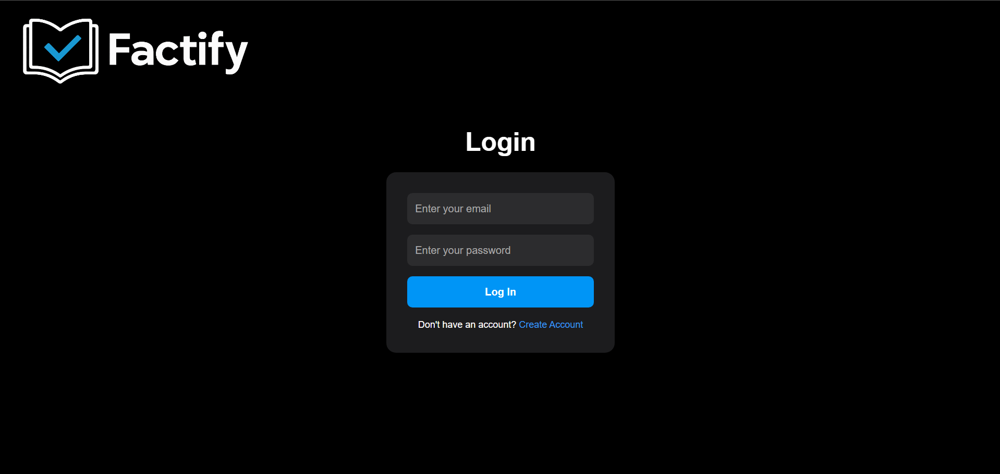
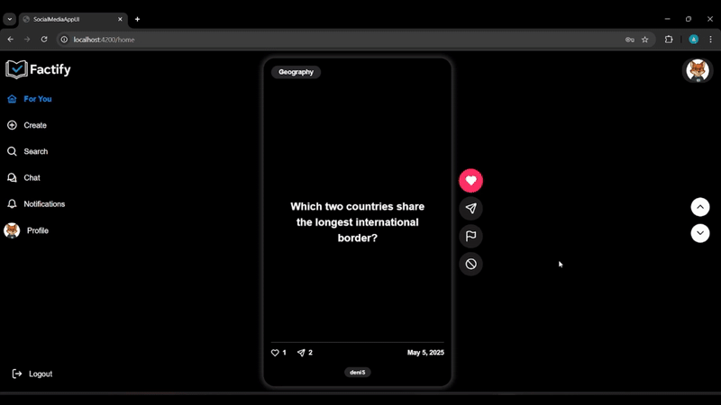
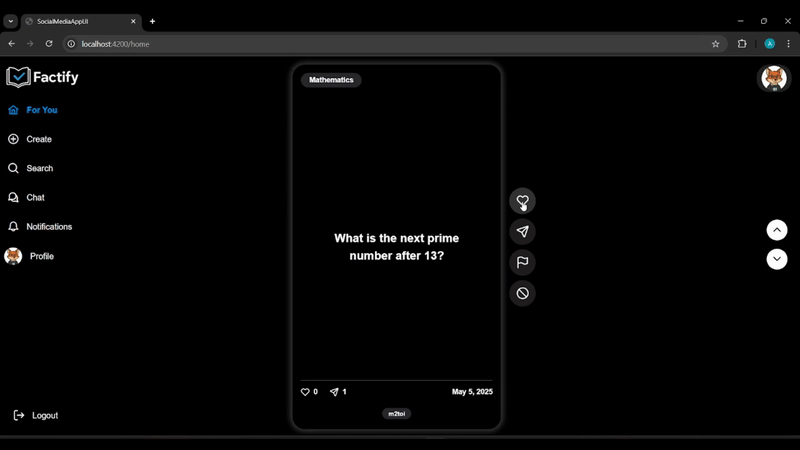
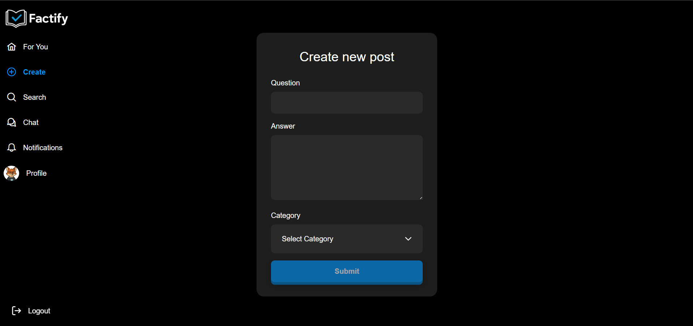
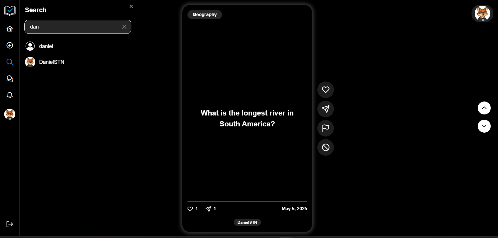
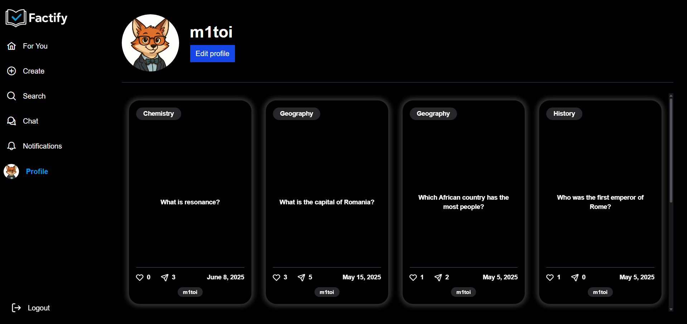
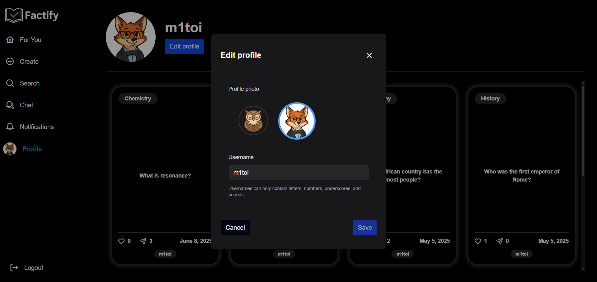
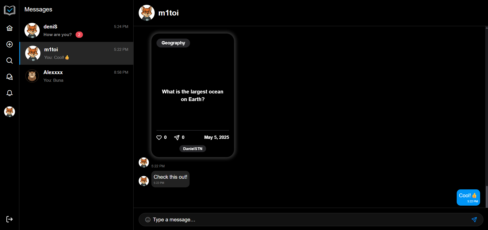
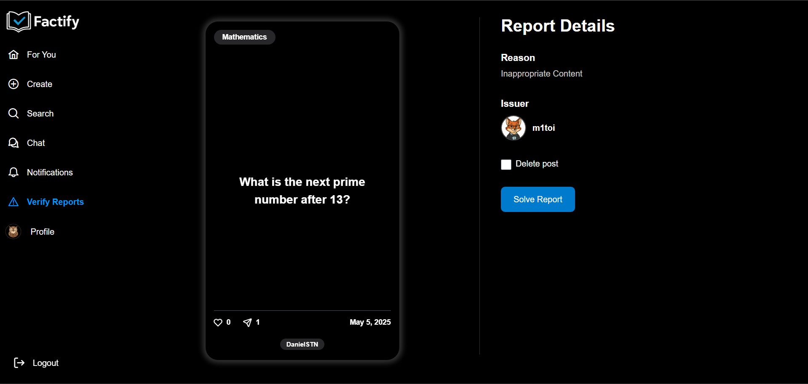

# Factify - Social Media Learning Platform

**Factify** transforms time spent on social media into an interactive and personalized learning experience. Designed as an educational alternative to traditional platforms, Factify blends the dynamics of a social network with structured, question-and-answer content, encouraging curiosity and personal growth.

##  Key Features

-   **Personalized "For You" Feed**: An intelligent algorithm delivers educational posts based on your interests and past interactions.
-   **Interactive Content**: Posts are presented as "flip cards," initially showing a question and revealing the answer with a single click.
-   **Content Creation**: Users can contribute to the platform by creating their own question-and-answer posts across various categories.
-   **Social Interactions**: Like, share, and report posts. Connect with other users through friend requests.
-   **Real-Time Communication**: A private chat system and instant notifications provide a fluid and dynamic social experience.
-   **User Profiles**: Every user has a customizable profile page to showcase their activity and created posts.
-   **Moderation & Safety**: A dedicated admin panel for managing reported content ensures a safe and constructive environment.

---

##  How to Use Factify

The platform is designed to be intuitive and familiar to any social media user. Here’s how you can navigate the key functionalities:

### 1. Authentication & Registration

To access Factify, you can create a new account or log in if you already have one. On your first login, you'll be invited to select a few categories of interest to tailor your experience right from the start.

| Register Page                               | Login Page                               |
| ------------------------------------------- | ---------------------------------------- |
|  |  |

### 2. The Main Feed

The feed is the heart of the application, where you'll discover new content curated just for you.

-   **Browse**: Scroll vertically to move from one post to the next.
-   **Reveal the Answer**: Click anywhere on a post's card to "flip" it and see the answer. The fluid animation makes learning more engaging.



### 3. Interacting with Posts

Each post includes a set of interaction buttons on the side:

-   ❤️ **Like**: Show your appreciation for a post. This helps the algorithm learn what content you enjoy.
-   ➤ **Share**: Share an interesting post with your friends directly within the app's chat.
-   🏳️ **Report**: If you find a post to be inappropriate, spam, or in the wrong category, you can report it for review.
-   🚫**Mark as not interesting**: If you don't like a certain post, you can remove it from your feed ensuring you will see less of those posts.    



### 4. Creating a Post

Contribute to the Factify community by creating your own educational content.

-   Navigate to the "Create" section from the sidebar.
-   Fill in the question, the answer, and select the appropriate category.
-   Click "Submit," and your post will become available to other users.



### 5. Searching for Users

Find and connect with other users through the search functionality in the sidebar. You can search by username and view their profiles.



### 6. User Profile

-   **Your Profile**: View all the posts you've created. You can also edit your username and profile picture to keep your identity up-to-date.
-   **Viewing Other Profiles**: See posts created by other users and send them a friend request to connect.

| Your Profile Page                               | Edit Profile Menu                               |
| ----------------------------------------------- | ----------------------------------------------- |
|  |  |

### 7. Chat & Notifications

-   **Notifications**: Receive real-time notifications for events like new friend requests. You can accept or deny requests directly from the notifications panel.
-   **Chat**: Once you are friends with another user, a private conversation is automatically created. You can exchange text messages, emojis, and even share posts from the feed directly into the chat.



### 8. Admin Panel

Users with an "Admin" role have access to a special "Verify Reports" panel. Here, they can:
-   View all active reports submitted by users.
-   Review the reported post and the reason for the report.
-   Decide to either permanently delete the post or dismiss the report.



---

## 🛠️ Tech Stack

-   **Frontend**: Angular 19, RxJS, PrimeNG, SCSS
-   **Backend**: ASP.NET Core 9, C#, Entity Framework Core
-   **Real-Time Communication**: SignalR
-   **Database**: Microsoft SQL Server
-   **Authentication**: JWT (JSON Web Tokens)

---

## ⚙️ Installation & Setup

Factify is built with a separate backend and frontend. To run the application locally, you will need to have both servers running.

**This repository contains the Angular frontend.** The backend server has its own repository and setup instructions.

### Prerequisites

-   [Node.js and npm](https://nodejs.org/en) (for the frontend)
-   A running instance of the [Factify Backend API](https://github.com/m1toi/Factify-BE) (see step 1)

### Step 1: Set Up the Backend Server

The backend is required for the frontend to function. It handles all business logic, database interactions, and user authentication.

1.  Go to the backend repository: **[Factify Backend Repository](https://github.com/m1toi/Factify-BE)**.
2.  Follow the setup and installation instructions provided in its `README.md` file.
3.  Once running, the backend API should be accessible, typically at `https://localhost:7091`.

### Step 2: Set Up the Frontend Application (This Repository)

Once the backend server is running, you can set up and start the Angular frontend.

```bash
# 1. Clone this repository
git clone https://github.com/m1toi/Factify-FE.git  
cd Factify-FE/

# 2. Install the necessary npm packages
npm install

# 3. Start the Angular development server
ng serve
